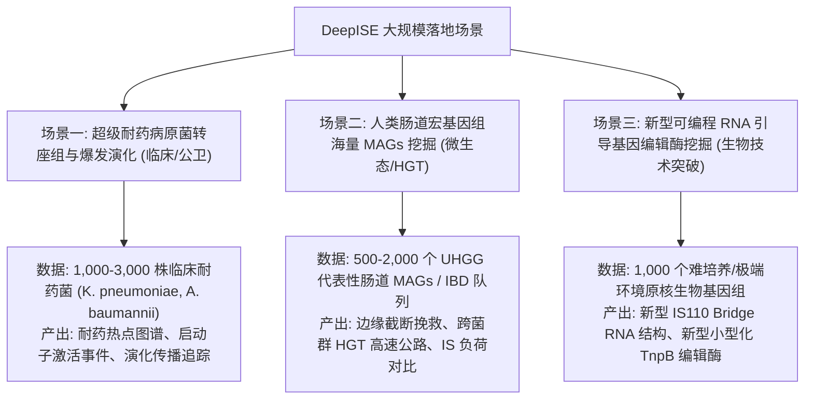

# DeepISE 大规模真实数据验证与高价值应用落地技术方案

## 一、方案背景与目标

随着 DeepISE 完成从 Phase-0 到 Phase-4 的全技术栈研发，系统已具备了**高灵敏度远源同源挖掘（ESM-2 AUPRC 0.9960）**、**全家族自适应与神经网络亚核苷酸精炼（平均误差降低 56.9%）**、**宏基因组流式分析与边缘截断分类（91% 准确率）**以及**极高计算效率（58.5x 快于经典工具 ISEScan）**的核心优势。

为了验证 DeepISE 在超大规模真实生物数据中的鲁棒性、泛化能力与应用价值，并产出高水平学术研究成果或解决临床实际问题，本方案制定了**三大高价值真实应用场景**与**端到端实施路线图**。

---

## 二、DeepISE 核心技术优势与差异化壁垒

| 评测维度 | 传统主流工具（如 ISEScan / digIS） | DeepISE 核心突破与技术壁垒 | 对大规模实际应用的意义 |
| :--- | :--- | :--- | :--- |
| **计算耗时与吞吐** | 单基因组耗时 ~7-10 分钟；大规模队列（1,000+ 样本）需数周甚至无法完成 | 单基因组仅需 **7.38 秒**（提速 **58.5 倍**），流式宏基因组达 **多兆碱基/秒** | 可支撑 **数千至数万级** 基因组/MAGs 的集群快速批处理 |
| **远源转座酶挖掘** | 严重依赖 BLASTP/Profile-HMM；<20% 相似度暮色区检出率仅 0~54% | 融合 **ESM-2 蛋白质语言模型**；暮色区召回率跃升至 **83.10%**（+28.17%） | 能够发现海量未被已知数据库记载的 **新转座酶与新变体** |
| **非经典转座机制** | 完全基于 TIR（反向重复）假设；对 IS200/IS605/IS91/IS110 等非经典家族漏报率 >90% | 内置 **发夹茎环（IS200）、ori/ter（IS91）及重组酶亚末端（IS110）** 专属物理模块 | 独家支撑挖掘新型 **Bridge RNA 重组系统** 与小型化基因编辑工具（TnpB） |
| **宏基因组装配断裂** | 无法感知 Contig 截断，边缘元件产生坐标越界崩溃或直接丢弃 | **原生支持 Contig 边缘截断感知**（`edge_5p`, `edge_3p`, `edge_both`），准确率 91% | 在高度碎片化的短读长宏基因组装配体中挽救数以万计的真实元件 |

---

## 三、三大高价值真实落地场景



### 场景一：超级耐药病原菌“转座组”（IS Mobilome）与临床耐药爆发溯源
- **临床科学痛点**：
  抗生素耐药基因（如碳青霉烯酶 *bla*KPC、*bla*NDM、*bla*OXA，以及多粘菌素耐药 *mgrB* 基因插入失活）在院内的快速爆发与水平扩散，绝大多数由特定插入序列（如 IS26、ISAba1、ISKpn 等）介导。传统工具因算力受限，难以在数千株耐药菌的大规模队列中完成全局插入热点（Insertion Hotspots）与基因组重排动态追踪。
- **数据来源与规模**：
  - **NCBI Pathogen Detection 数据库**：筛选高危临床克隆株大队列（如 1,000 ~ 3,000 株肺炎克雷伯菌 *Klebsiella pneumoniae* ST11/ST258、鲍曼不动杆菌 *Acinetobacter baumannii* 或铜绿假单胞菌 *Pseudomonas aeruginosa*）。
- **DeepISE 交付成果**：
  1. **极速全景注释**：在集群并行下，仅需数小时即可完成数千株耐药菌的完整 IS 注释；
  2. **耐药启动子/基因捕获**：精确定位 IS 插入在抗生素耐药基因启动子区（提供外源强启动子激活转录）或结构基因内部（打断防线基因）的实际临床事件；
  3. **耐药转座热点图谱**：绘制全基因组维度的“IS 插入热点与耐药岛协同演化网络”。

### 场景二：人类肠道微生物组海量 MAGs 的转座元件挖掘与水平转移（HGT）分析
- **微生态科学痛点**：
  人体肠道微生物组与代谢、免疫及肿瘤免疫治疗应答紧密相关。目前已组装积累了超 20 万个非冗余人类肠道细菌 MAGs（如 UHGG 目录）。但受短读长宏基因组拼装算法限制，重复序列断裂导致 Contig 两端富集截断的转座酶，传统工具因无截断感知而导致**大量未培养厌氧共生菌的 IS 元件被严重低估或漏报**。
- **数据来源与规模**：
  - **UHGG (Unified Human Gastrointestinal Genome)**：提取 500 ~ 2,000 个代表性未培养肠道细菌 MAGs，或人类疾病队列宏基因组组装 Contigs（如炎症性肠病 IBD vs 健康对照）。
- **DeepISE 交付成果**：
  1. **边缘截断元件全量回收**：利用 Phase-4 的 `edge_truncation` 分类体系，完整找回因组装断裂被传统工具丢弃的 IS 碎片；
  2. **跨物种水平转移（HGT）高速公路**：基于 100% 序列一致的 IS 元件在不同属/门肠道共生菌与机会致病菌之间的分布，揭示肠道微生态基因流动路径；
  3. **疾病状态下的 IS 负荷差异**：量化微生态失衡状态（如抗生素暴露、IBD）下微生物组的转座活跃度（IS Load）。

### 场景三：挖掘新型可编程 RNA 引导基因编辑工具前体（前沿生物技术突破点）
- **前沿技术痛点**：
  插入序列是下一代可编程基因组编辑工具的重大发源地：
  - **IS110 家族**：2024 年 *Nature* 重大突破揭示其编码 **Bridge RNA**，可实现不依赖双链断裂的兆碱基级 DNA 定点大片段插入/倒位；
  - **IS200/IS605 家族**：编码 **TnpB**（Cas12 的进化祖先，超小型化基因编辑系统）。
  传统工具（如 ISEScan、digIS）因严格依赖 TIR 而完全无法有效识别无 TIR 的 IS110 和 IS200 元件。
- **数据来源与规模**：
  - 极端环境微生物（嗜热、深海热液、高盐等）或 NCBI 难培养古菌/细菌的 1,000 ~ 2,000 个全基因组/草图。
- **DeepISE 交付成果**：
  1. **非经典家族专属捕获**：依托内置的发夹茎环与重组核心位点识别模块，高效捕获全长 IS110 与 IS200/IS605；
  2. **Bridge RNA 与 TnpB 候选库筛选**：自动化截取其非编码侧翼与非编码 RNA 结构，筛选具备潜在基因编辑与大片段重组活性的新型工具候选酶，具备极高专利转化与高影响力发表价值。

---

## 四、四步落地实施路线图

```
┌─────────────────────────────────────────────────────────────┐
│ 第 1 步: 先导数据集评测 (Pilot 100-200 个代表性样本)         │
│  - 验证端到端自动化批处理脚本，确认吞吐量与内存占用稳定性   │
└──────────────────────────────┬──────────────────────────────┘
                               │
┌──────────────────────────────▼──────────────────────────────┐
│ 第 2 步: SLURM 集群大规模阵列批处理 (1,000-5,000 个样本)     │
│  - 依托 HPC 节点，并发执行 deepise scan / scan-metagenome   │
└──────────────────────────────┬──────────────────────────────┘
                               │
┌──────────────────────────────▼──────────────────────────────┐
│ 第 3 步: 跨模态生物学关联挖掘与自动化质控                     │
│  - 结合耐药基因 (AMRFinderPlus/CARD)、功能分类与演化分析     │
└──────────────────────────────┬──────────────────────────────┘
                               │
┌──────────────────────────────▼──────────────────────────────┐
│ 第 4 步: 产出发表级图表与学术论文成果                        │
│  - 全景 Circos 图、IS 插入热点图、系统发育演化树与负荷对比   │
└─────────────────────────────────────────────────────────────┘
```

### 实施细节规范：
1. **数据抓取与标准化**：统一通过 NCBI Entrez / datasets 命令行拉取基因组 FASTA，严格过滤装配质量（N50、Contig 数量）；
2. **集群任务调度**：利用 `sbatch --array=1-N` 阵列作业，每个任务分配 4 CPU 线程与 4 GB 内存，实现线性的吞吐扩展；
3. **关联分析流水线**：
   - 使用 `bedtools intersect` 计算 IS 元件与抗生素耐药基因（ARG）或毒力因子（VF）的物理距离（如 $\le 5\text{ kb}$ 窗口）；
   - 使用 `CD-HIT` 对检出的全部新 IS 序列进行聚类，计算新元件的分类多样性与谱系特异性。

---

## 五、首选切入点建议与实施准备

为快速见效并兼顾学术发表价值，建议优先采取 **“两步走”** 策略：

### 阶段 1：先导验证试验（Pilot Experiment，预计 1~2 天）
- **选型方案**：**100 ~ 200 株临床高危肺炎克雷伯菌（*Klebsiella pneumoniae*）真实全基因组/草图数据**；
- **执行内容**：
  1. 编写批量拉取与格式化脚本（存入 `data/pilot_cohort/`）；
  2. 运行 `deepise scan` / `deepise scan-metagenome` 自动化批处理；
  3. 统计每个菌株平均检出 IS 数、家族分布、截断比例、以及与已报道耐药基因（如 *bla*KPC）的物理共定位率；
  4. 产出首份《DeepISE 临床大队列先导验证实测报告》。

### 阶段 2：规模化扩展与成果产出（Scale-up Phase，预计 1~2 周）
- 将样本量扩展至 1,000 ~ 3,000 株病原菌或 1,000 个肠道 MAGs；
- 完成系统演化树构建与耐药扩散网络解析，撰写学术论文初稿并输出全套发表级图表。

---

## 六、文件与归档信息

- **文档名称**：`DEEPISE_LARGE_SCALE_VALIDATION_ROADMAP.md`
- **保存路径**：`/hpcfs/fhome/caizhh/Desktop/03_Tool_Development/05_DeepISE/DEEPISE_LARGE_SCALE_VALIDATION_ROADMAP.md`
- **生成日期**：2026-09-12
- **关联代码**：
  - 核心 CLI 入口：[`python/deepise_ml/cli.py`](python/deepise_ml/cli.py)
  - 宏基因组生产引擎：[`python/deepise_ml/metagenome/scanner.py`](python/deepise_ml/metagenome/scanner.py)
  - 评测基准代码：[`python/deepise_ml/metagenome/benchmark.py`](python/deepise_ml/metagenome/benchmark.py)
