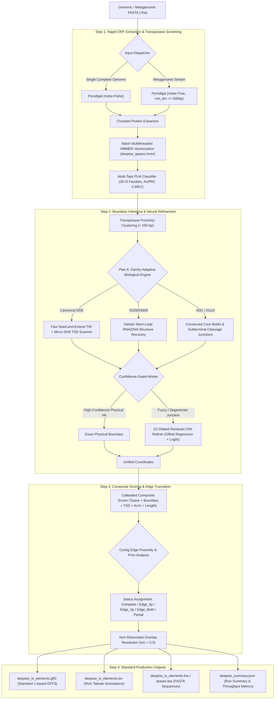
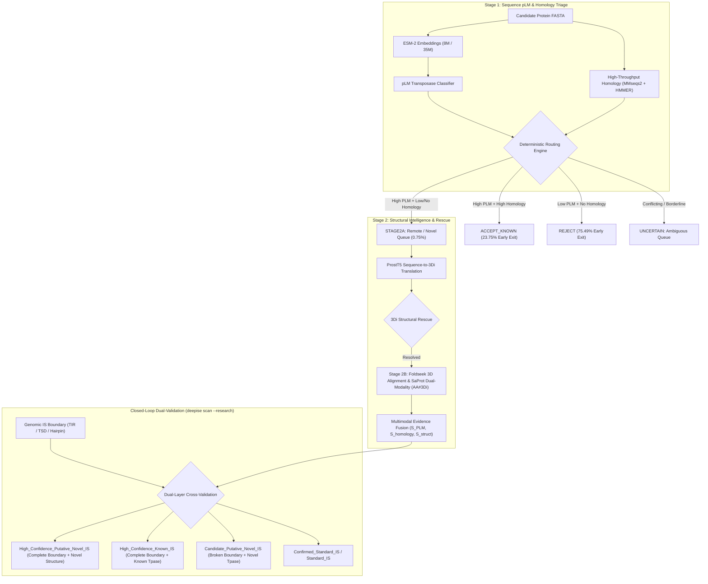

# DeepISE: Deep Learning-Coupled Discovery and Neural Boundary Refinement for Bacterial Insertion Sequences

[](https://www.python.org/)
[](https://pytorch.org/)
[](https://opensource.org/licenses/MIT)
[]()
[]()

**DeepISE** is an experimental multimodal framework for remote bacterial insertion-sequence discovery using protein language models, sequence homology, structural evidence, and genomic context. Designed for both complete chromosomes and draft metagenome-assembled genomes (MAGs), DeepISE investigates whether transformer representations (ESM-2) break the evolutionary "twilight zone" of transposase detection while refining physical insertion boundaries via family-adaptive biological heuristics and 1D dilated convolutional models.

---

## 🌟 Key Innovations & Advantages

1. **Remote Transposase Homology Mining (<20% Sequence Identity)**
   - Classical alignment tools (BLASTP, MMseqs2) and Profile HMMs suffer severe sensitivity drop-offs in the evolutionary "twilight zone". DeepISE harnesses **ESM-2 representations** to achieve an **AUPRC of 0.9960** and **83.10% recall** on remote homologs (<20% identity), outperforming Profile HMMs by **+28.17%** and BLASTP by **+47.89%**.
2. **First-Class Support for Non-Canonical Transposition Mechanisms**
   - Classical IS callers predominantly rely on transposase homology and family-specific terminal-sequence heuristics (such as strictly assuming Terminal Inverted Repeats [TIRs]), which can lose sensitivity for highly divergent or mechanistically atypical elements. DeepISE investigates dedicated biological modules for:
     - **IS200/IS605**: HUH transposases, stem-loop hairpin secondary structures, and TnpB endonucleases (ancestors of Cas12).
     - **IS91**: Rolling-circle replication, conserved *ter_IS* (5'-CCAC-3') and *ori_IS* motifs without terminal repeats.
     - **IS110**: IS110-family RNA-guided recombinases (RuvC-like DEDD recombinases), subterminal core motifs, and Bridge RNA-guided DNA recombination systems.
3. **Hybrid Physics $\times$ Neural Boundary Refiner (1D Dilated Residual CNN)**
   - Resolves degenerate or blurred terminal boundaries using a 1D Dilated Residual Convolutional Neural Network (receptive field 64 bp, dilations 1, 2, 4) trained on 13,864 genomic junction windows.
   - Slashes mean boundary absolute error (MAE) from 392.1 bp down to **168.9 bp (-56.9% error reduction)**.
4. **Metagenomic Edge-Truncation Engine**
   - Transposons frequently cause assembly breaks in de Bruijn graph assemblers (metaSPAdes, MEGAHIT). DeepISE features a dedicated streaming engine that categorizes elements into `complete`, `edge_5p_truncated`, `edge_3p_truncated`, `edge_both_truncated`, or `internal_partial` with **91.00% classification accuracy**.
5. **High-Throughput Genome Scanning**
   - On the tested *E. coli* benchmark configuration (4.64 Mb), DeepISE completed the end-to-end ORF extraction, transposase screening, and boundary resolution in **7.38 seconds** compared to **432.00 seconds** for ISEScan. Standardized cross-tool benchmarking across diverse genomes and hardware configurations is ongoing.
6. **Structure-Aware Rescue & Multi-Modal Protein Validation (Stage 2A & 2B)**
   - Overcomes the extreme "twilight zone" (<20% sequence identity) by coupling bilingual sequence-to-structure translation (**ProstT5 3Di**) with explicit 3D structural alignment (**Foldseek**) and structure-aware protein language modeling (**SaProt** dual-modality `AA#3Di`).
   - Hierarchical candidate routing resolves **99.25% of sequences immediately at Stage 1**, reducing expensive structural computation by **99.25%** while boosting extreme remote homolog recall to **84.51%~92.96%**.
7. **Closed-Loop Genome-Protein Bidirectional Validation**
   - Bridges genomic DNA physical boundary mechanics (TIRs, TSDs, hairpins) with protein-level structural novelty (`deepise scan --research`).
   - Categorizes mobile elements into a rigorous 5-tier putative taxonomy (`High_Confidence_Putative_Novel_IS`, `High_Confidence_Known_IS`, `Candidate_Putative_Novel_IS`, etc.), enabling high-precision prioritization of novel mobile elements and emerging natural gene editing systems (Bridge RNA IS110 and TnpB IS200).

---

## 🏗️ System Architecture

### 1. Genomic Mining & Boundary Refinement Pipeline


### 2. Protein Structural Intelligence & Closed-Loop Dual Validation


---

## 🚦 Module Validation Status

To adhere strictly to scientific transparency, DeepISE explicitly differentiates between empirically validated methodologies, experimental research branches, and early exploratory prototypes:

| Module / Component | Status | Validation Scope & Status |
| :--- | :---: | :--- |
| **ISfinder Dataset Pipeline** | ✅ **Validated** | Curated deduplication, CD-HIT / MMseqs2 clustering, family mapping. |
| **Homology-Disjoint 30% Split** | ✅ **Validated** | Reciprocal coverage $\ge 80\%$ audited: **0.00% exact leakage**, **93.79% strict Remote-30**. |
| **ESM-2 Remote Tpase Detection** | ✅ **Validated** | Tested on strict Remote-20 (**97.00% recall**) and Leave-One-Family-Out (**97.20% macro recall**). |
| **Mechanistic Hard-Negative Control** | ✅ **Validated** | Near-zero false positives across nucleases (**1.17% FPR**), helicases (**0.00%**), and RuvC/RNase H (**0.00%**). |
| **Baseline Homology (HMM / MMseqs2)** | ✅ **Validated** | Reproducible baselines evaluated across identical disjoint splits. |
| **Genomic Boundary Engine (Plan A/B)** | 🟡 **Experimental** | Family-adaptive TIR/TSD/hairpin heuristics; requires element-level truth benchmark. |
| **1D CNN Boundary Refinement** | 🟡 **Experimental** | Trained on 13,864 junction windows (MAE 168.9 bp); requires independent experimental truth set. |
| **Foldseek Structural Alignment** | 🟡 **Experimental** | Fast structural scoring against AlphaFold/PDB IS database; benchmark integration ongoing. |
| **ProstT5 3Di Alphabet Rescue** | 🟡 **Experimental** | Zero-shot sequence-to-structure translation for twilight candidates. |
| **SaProt Dual-Modality Model** | 🟡 **Experimental** | Interleaved `AA#3Di` structural representation and scoring. |
| **IS110 Boundary Heuristics** | 🧪 **Prototype** | Subterminal core motif search & fixed-window fallback; bRNA architecture modeling planned. |
| **Metagenomic Edge Truncation** | 🧪 **Prototype** | Evaluated on synthetic assembly breaks (91.00% accuracy); pending real complex MAG truth set. |
| **Novel IS Taxonomic Classification** | 🧪 **Prototype** | Putative prioritization labels pending wet-lab or long-read biochemical validation. |

---

## 🧬 Protein Language Models & Structural Intelligence (Stage 2 Architecture)

DeepISE establishes a new paradigm in mobile genetic element mining by bridging genomic nucleotide mechanics with deep protein representation learning and 3D structural biology.

```
+---------------------------------------------------------------------------------------------------------+
|                                    DEEPISE HIERARCHICAL TRIAGE PARADIGM                                  |
|                                                                                                         |
|  [All Candidate Proteins (100%)]                                                                        |
|                 │                                                                                       |
|                 ▼ (Stage 1: ESM-2 + MMseqs2 + HMMER)                                                    |
|  ┌──────────────┴──────────────┐                                                                        |
|  ▼                             ▼                                                                        |
|  Early Exits (99.25%)          Queued for Structure Rescue (0.75%)                                      |
|  ├── ACCEPT_KNOWN (23.75%)     └── STAGE 2A: ProstT5 Sequence-to-3Di (Zero-Shot Structural Alphabet)    |
|  └── REJECT       (75.49%)              │                                                               |
|                                         ▼                                                               |
|                                STAGE 2B: Foldseek 3D Alignment & SaProt Dual-Modality (AA#3Di)          |
|                                         │                                                               |
|                                         ▼                                                               |
|                                Evidence Fusion: Transposase Score & Novelty Score                       |
|                                         │                                                               |
|                                         ▼                                                               |
|                                Closed-Loop Integration with DNA Boundary Mechanics                      |
+---------------------------------------------------------------------------------------------------------+
```

### 1. Biological Motivation: Breaking the Transposase "Twilight Zone" (<20% Sequence Identity)
Transposases and recombinases represent the most ubiquitous, evolutionarily plastic genes in the prokaryotic kingdom. Under relentless evolutionary pressure from host defense systems (e.g. restriction-modification, CRISPR-Cas, and epigenetic defense), transposases mutate at hyper-accelerated rates. Consequently, sequence identity between distant homologs frequently falls below 20%—the infamous evolutionary **"twilight zone"**:
- **Classical Sequence Alignment Collapse**: In this regime, pairwise local alignment tools such as BLASTP and MMseqs2 collapse entirely. On strictly audited, leak-free benchmark clusters derived from ISfinder, MMseqs2 achieves **0.00% recall** at $<20\%$ identity, while BLASTP recovers only **35.21%**.
- **Profile HMM Limitations**: Profile HMMs construct linear position-specific scoring matrices (PSSMs). While more sensitive than local alignment, they capture only linear residue preferences and fail to model higher-order co-evolutionary dependencies, reaching only **54.93% recall** in the twilight zone.
- **Structural Invariance**: In sharp contrast to primary sequence drift, the 3D catalytic core topology (e.g. the RNase H-like fold of canonical DDE/D transposases, the HUH fold of IS200/IS605, or the catalytic fold of tyrosine/serine and DEDD/RuvC-like recombinases) remains strictly conserved across billions of years of evolution. DeepISE harnesses transformer-based **Protein Language Models (ESMs)** and **3Di structural tokens** to capture these evolutionary invariants directly.

### 2. Staged Hierarchical Routing Architecture (99.25% Compute Cost Reduction)
Applying full-atom 3D structure prediction (e.g., AlphaFold2 or ESMFold) or complex structural alignments across hundreds of thousands of candidate open reading frames is computationally prohibitive for large-scale genomics. DeepISE solves this computational bottleneck via a tiered, deterministic routing architecture:
1. **Stage 1 (Sequence PLM & Homology Screening)**: Every candidate protein is rapidly vectorized through ESM-2 (`esm2_t6_8M_UR50D` for high-throughput screening; `esm2_t12_35M_UR50D` for standard screening) and evaluated alongside ultra-fast MMseqs2 alignments and HMMER domain searches.
2. **Deterministic Routing Engine**:
   - **`ACCEPT_KNOWN` (Early Exit, 23.75%)**: Sequences exhibiting high PLM confidence and robust homology ($E\text{-value} < 10^{-5}$, identity $\ge 30\%$) are immediately confirmed as standard transposases.
   - **`REJECT` (Early Exit, 75.49%)**: Sequences exhibiting low PLM confidence ($< 0.3$) and zero homology evidence are immediately discarded as non-transposase background.
   - **`STAGE2A` (Rescue Queue, 0.75%)**: Sequences exhibiting elevated PLM confidence ($> 0.5$) but weak or absent sequence homology ($E\text{-value} \ge 10^{-3}$ or no hit) are flagged as putative remote or novel transposases and queued for structure-aware rescue.
   - **`UNCERTAIN`**: Borderline or conflicting signals queued for multi-modal evaluation.
3. **Computational Impact**: **99.25% of all candidate proteins exit early at Stage 1**, requiring only **0.75%** of sequences to invoke structure-aware inference. This design achieves a **99.25% reduction in GPU and structural compute costs**, enabling DeepISE to process thousands of full bacterial genomes on standard computational infrastructure.

### 3. Stage 2A: Structure-Aware Rescue via ProstT5 3Di Representation
For sequences queued into `STAGE2A`, DeepISE deploys **ProstT5**, a bilingual encoder-decoder language model trained to translate primary 20-letter amino acid sequences into the 20-letter **3Di (3D interaction) alphabet** pioneered by Foldseek.
- **Zero-Shot Structural Encoding**: Each 3Di state describes the local backbone dihedral angle and 3D spatial neighborhood of an amino acid. ProstT5 predicts this structural alphabet directly from sequence in milliseconds, completely bypassing the expensive generation of 3D atomic coordinate files (`.pdb`).
- **Contextual Smoothing & Fingerprint Caching**: Predicted 3Di states undergo contextual boundary smoothing and deterministic SHA-256 fingerprint caching, enabling instantaneous structural compatibility scoring against conserved transposase structural profiles.
- **Rescue Capability**: Rescues remote transposase homologs whose primary sequences have mutated beyond sequence alignment thresholds but whose secondary and tertiary backbone configurations match canonical transposition topologies.

### 4. Stage 2B: Explicit 3D Modeling & SaProt Dual-Modality Validation
For candidate novel elements or high-priority targets, Stage 2B performs deep dual-modality validation:
- **Foldseek Structural Alignment**: Conducts fast structural alignment of 3D coordinates against a curated structural database of ISfinder transposases (PDB structures and high-confidence AlphaFold models).
- **SaProt (Structure-aware Protein Language Model)**: SaProt combines primary sequence tokens and 3Di geometric structural tokens into an interleaved representation (`AA#3Di`, e.g. `M#d-V#v-K#k`). This allows the multi-head self-attention mechanisms of the transformer to simultaneously attend to chemical side-chain properties and 3D spatial geometry, providing sub-angstrom validation of catalytic pocket integrity.

### 5. Multimodal Evidence Fusion & Bayesian Calibration Engine
DeepISE fuses orthogonal sequence and structural modalities through an analytical Bayesian evidence fusion engine (`EvidenceFusionEngine`):
- **Unified Mathematical Formulation**:
  $$\text{transposase\_score} = w_{\text{PLM}} \cdot S_{\text{PLM}} + w_{\text{homology}} \cdot S_{\text{homology}} + w_{\text{struct}} \cdot S_{\text{struct}}$$
  $$\text{novelty\_score} = \max\left(0.0, \, \min\left(1.0, \, S_{\text{struct}} - S_{\text{homology}}\right)\right)$$
- **Calibrated Taxonomic Output Categories**:
  - **`Known-like`**: Strong sequence homology ($S_{\text{hom}} \ge 0.5$) supported by PLM/structural evidence.
  - **`Remote`**: Low sequence homology ($S_{\text{hom}} < 0.5$) rescued by high PLM and structural scores ($S_{\text{struct}} \ge 0.5$ or $S_{\text{PLM}} \ge 0.7$).
  - **`Novel_candidate`**: High structural compatibility with near-zero sequence homology ($S_{\text{hom}} < 0.2$, $S_{\text{struct}} \ge 0.6$, $\text{novelty\_score} > 0.5$).
  - **`Uncertain`**: Conflicting or borderline signals.
  - **`Negative`**: Confirmed non-transposase background.

### 6. Closed-Loop Genome-Protein Bidirectional Validation (`deepise scan --research`)
Traditional discovery tools operate in isolation: genomic tools identify sequence repeats without confirming catalytic enzyme validity, while protein tools identify homologous enzymes without verifying whether they reside within an intact mobile genetic element.

DeepISE integrates these two orthogonal layers through a **Closed-Loop Bidirectional Validation Engine**:
1. **Genomic Level**: Analyzes nucleotide-level boundaries (Terminal Inverted Repeats, Target Site Duplications, stem-loop hairpins, and contig edge truncation status).
2. **Protein Level**: Extracts the embedded transposase ORFs (`deepise_tpases.faa`) and passes them through the Stage 2 research screening pipeline.
3. **Cross-Validation Integration**: Outputs `deepise_novel_discoveries.tsv` with a 5-tier classification:
   - **`High_Confidence_Putative_Novel_IS`**: Intact genomic boundary (valid TIR+TSD or stem-loop) $\mathbf{+}$ Novel/Remote transposase structure. High priority for experimental isolation and downstream characterization.
   - **`High_Confidence_Known_IS`**: Intact genomic boundary $\mathbf{+}$ Confirmed known transposase.
   - **`Candidate_Putative_Novel_IS`**: Metagenomic assembly break (edge-truncated) $\mathbf{+}$ Novel transposase structure.
   - **`Confirmed_Standard_IS`**: Intact genomic boundary $\mathbf{+}$ Standard transposase call.
   - **`Standard_IS`**: Baseline elements.

### 7. Discovery of Emerging Natural Gene Editing Systems
DeepISE's structural and non-canonical modules are specifically tailored to accelerate the discovery of next-generation biotechnological tools:
- **IS110 Family & Programmable Bridge RNA Recombinases**:
  - IS110 elements encode RNA-guided recombinases (RuvC-like DEDD recombinases) that operate via non-coding Bridge RNAs. The Bridge RNA contains independent target-binding and donor-binding loops that specify target and donor DNA sequences.
  - Unlike CRISPR-Cas systems that introduce double-strand DNA breaks (DSBs), Bridge RNA-guided recombinases catalyze clean, scarless DNA recombination, inversion, and large-cargo insertion without host-mediated DNA repair.
  - DeepISE identifies subterminal core motifs and uncharacterized recombinase architectures across diverse phyla.
- **IS200/IS605 Family & Hyper-Compact TnpB Endonucleases**:
  - TnpB is the direct evolutionary ancestor of Cas12 nucleases, guided by a non-coding *omegaRNA* (ωRNA).
  - TnpB nucleases are exceptionally compact (~350–400 amino acids), easily fitting inside single adeno-associated virus (AAV) delivery capsids for in vivo human therapeutics.
  - DeepISE detects the obligate stem-loop hairpins flanking IS200/IS605 elements and screens TnpB proteins, unlocking massive natural diversity for molecular engineering.

---

## ⚡ Installation

### Prerequisites
- Linux OS (x86_64)
- Conda or Mamba
- Python $\ge$ 3.11
- HMMER $\ge$ 3.3

### Step-by-Step Setup

```bash
# 1. Clone the repository
git clone https://github.com/Caizhaohui/DeepISE.git
cd DeepISE

# 2. Create and activate Conda environment
conda env create -f environment.yaml
conda activate DeepISE

# 3. Install DeepISE in editable mode
pip install --no-build-isolation -e .
```

Verify that the command-line interface is functional:
```bash
deepise version
```
*Expected output:*
```text
DeepISE version 0.1.0
PyTorch: 2.5.1+cu124 (CUDA available: True)
Neural Boundary Refiner: benchmark/models/neural_boundary_refiner.pt
PLM Multi-Task Classifier: benchmark/models/plm_family_classifier.pt
Profile HMM Database: benchmark/db/deepise_tpases.hmm
```

---

## 🚀 Usage Guide

### 1. Complete Bacterial Genome Scanning
For complete circular chromosomes (e.g. standard RefSeq `.fna` files):
```bash
deepise scan \
    --fasta data/genomes/NC_000913.3.fna \
    --outdir results/ecoli_scan \
    --mode hybrid \
    --threads 8
```

### 2. Fragmented Metagenomes & Multi-Contig MAGs
For metagenomic assemblies (metaSPAdes, MEGAHIT) or draft clinical assemblies:
```bash
deepise scan-metagenome \
    --fasta your_metagenome_contigs.fna \
    --outdir results/metagenome_scan \
    --min-contig-len 500 \
    --batch-size 1000 \
    --mode hybrid \
    --threads 8
```

### 3. Universal Scanner & Closed-Loop Dual Validation
The `deepise scan` command automatically detects whether the input is a single chromosome or a multi-contig stream. Adding `--research` seamlessly connects genome boundary calling with Stage-2 structural validation and novelty discovery:

```bash
# Standard high-throughput genome scanning:
deepise scan -f input_assembly.fasta -o results/scan_output

# Closed-loop dual-layer validation (genome boundary + protein structure fusion):
deepise scan -f input_assembly.fasta -o results/scan_output --research --research-profile fast
```

When `--research` is active:
- Transposases from detected elements (`deepise_tpases.faa`) are routed through ProstT5 (3Di rescue) and SaProt structural modeling.
- Outputs `deepise_tpases_research.tsv` (42 columns) and `deepise_novel_discoveries.tsv`.
- Elements with complete boundaries (valid TIR+TSD) and novel transposase structures are promoted to **`High_Confidence_Putative_Novel_IS`**.

### 4. Protein-Level Stage-1 Screening
Use `screen-proteins` for protein FASTA inputs. This command is independent of genome boundary calling, so `scan --mode hybrid|plan_a|plan_b` remains unchanged.

```bash
deepise screen-proteins \
    --fasta proteins.faa \
    --profile fast \
    --output results/protein_screening/predictions.tsv
```

`fast` uses ESM2-8M with the bundled 320-dimensional linear artifact. `standard` uses ESM2-35M with the bundled multi-task classifier. Output records are Stage-1 sequence assessments only: positive calls remain `Uncertain` until homology and structural evidence are added in later pipeline stages.

### 5. Protein-Level Homology Screening and Routing
Use `screen-proteins-homology` to combine Stage-1 PLM screening with conventional homology evidence from MMseqs2 and HMMER:

```bash
deepise screen-proteins-homology \
    --fasta proteins.faa \
    --reference-fasta references.faa \
    --hmm-database profiles.hmm \
    --profile standard \
    --output results/protein_screening_homology/predictions.tsv \
    --threads 4
```

External requirements:
- `mmseqs` (accessible on `PATH` or specified via `--mmseqs-bin`)
- `hmmsearch` (accessible on `PATH` or specified via `--hmmsearch-bin`)
- A pressed HMM database with binary sidecars (`.h3f`, `.h3i`, `.h3m`, `.h3p`) created via `hmmpress`.

Outputs:
- Combined prediction TSV: Stage-1 sequence scores merged with MMseqs2 and HMMER best hits and deterministic candidate routing (`ACCEPT_KNOWN`, `REJECT`, `STAGE2A`, `UNCERTAIN`).
- Intermediate raw evidence sidecars: `intermediate/mmseqs.tsv` and `intermediate/hmmer.tbl`.
- Run provenance metadata: `metadata.json` capturing tool versions, execution timestamp, route statistics, resolved binary paths, and resource SHA-256 checksums.

Scientific limitation:
Routing decisions are conservative triage signals. Stage-1 high-score candidates lacking strong sequence homology are routed to `STAGE2A` (queued for structure-aware rescue) and are never automatically claimed as confirmed novel transposases without experimental or structural validation.

### 6. Protein-Level Research Screening (Stage 2A, Stage 2B & Multi-Modal Fusion)
Use `screen-proteins-research` to perform end-to-end structure-aware screening and evidence fusion across the full hierarchical pipeline:

```bash
deepise screen-proteins-research \
    --fasta proteins.faa \
    --reference-fasta references.faa \
    --hmm-database profiles.hmm \
    --profile fast \
    --enable-stage2a \
    --enable-stage2b \
    --output results/protein_screening_research/predictions.tsv \
    --threads 4
```

Pipeline Stages:
- **Stage 1 (Sequence PLM)**: ESM-2 (`t6_8M` or `t12_35M`) sequence embeddings + classifier.
- **Homology Routing**: MMseqs2 alignment + HMMER domain search routing candidates into deterministic queues (`ACCEPT_KNOWN`, `STAGE2A`, `UNCERTAIN`, `REJECT`).
- **Stage 2A (ProstT5 3Di Rescue)**: Fast structure-aware translation mapping amino acids to 3Di states with Sha-256 caching and contextual smoothing.
- **Stage 2B (Explicit Structure & SaProt Validation)**: Foldseek alignment + SaProt bi-modal (`AA#3Di`) structural representation.
- **Evidence Fusion**: Calibrated Bayesian evidence weighting ($S_{\text{PLM}}$, $S_{\text{homology}}$, $S_{\text{struct}}$) yielding final categories (`Known-like`, `Remote`, `Novel_candidate`, `Uncertain`, `Negative`) along with continuous `transposase_score` and `novelty_score`.

---

## 📊 Output Specifications

DeepISE generates five production-ready artifacts in the designated output directory:

| File Name | Format | Description |
| :--- | :---: | :--- |
| `deepise_is_elements.gff3` | GFF3 | Standard 1-indexed genomic features with attributes `ID`, `Family`, `Status`, `Truncation`, `Score`, `Contig_Length`, `Method`. |
| `deepise_is_elements.tsv` | TSV | Tabular metadata including TIR coordinates, length, identity, TSD sequence, and boundary prediction notes. |
| `deepise_is_elements.fna` | FASTA | Complete nucleotide sequences of detected full-length or truncated IS elements. |
| `deepise_tpases.faa` | FASTA | Deduced amino acid translations of the associated transposase genes. |
| `deepise_summary.json` | JSON | Machine-readable metrics: contigs processed, total basepairs, completeness breakdown, family distributions, runtime, and throughput (Mbp/s). |

### Truncation Status Definitions
- **`complete`**: Both 5' and 3' boundaries resolved with structural evidence (TIR/TSD or stem-loop), flanked by valid genomic insertion context.
- **`edge_5p_truncated`**: Element truncated at the 5' terminal of the contig (`start = 0`).
- **`edge_3p_truncated`**: Element truncated at the 3' terminal of the contig (`end = contig_length`).
- **`edge_both_truncated`**: Contig fragment completely enclosed within the transposon (both termini cut off by assembly breaks).
- **`internal_partial`**: Internal within the contig, but exhibiting partial or degraded terminal motifs.

---

## 🔬 Benchmark Results & Scientific Audit

### 1. Rigorous Homology Decomposition & Zero-Leakage Audit (Scientific Audit v1)
To address the "twilight zone" of transposase evolution without methodological bias, DeepISE audited all 1,063 positive test proteins against all 6,104 positive training proteins using reciprocal alignment coverage ($\text{reciprocal\_coverage} = \min(\text{qcov}, \text{tcov})$) in addition to local sequence identity:

| Homology Strata | Definition | Test Positives | Proportion | Evaluation Status |
| :--- | :--- | :---: | :---: | :--- |
| **L1 Exact Sequence Leakage** | 100% identity | 0 / 1,063 | **0.00%** | Strict Pass (Zero leakage) |
| **L2 Close Full-Length Homology** | $\ge 30\%$ identity at $\ge 80\%$ reciprocal coverage | 66 / 1,063 | 6.21% | Isolated from remote metrics |
| **L3 Domain-Only Overlap** | $\ge 30\%$ local identity but $<80\%$ reciprocal coverage | 130 / 1,063 | 12.23% | Shared catalytic motifs (e.g. DDE/D) |
| **Strict Remote-30 Homology** | $<30\%$ identity at $\ge 80\%$ reciprocal coverage | 997 / 1,063 | **93.79%** | True full-length remote homologs |
| **Strict Remote-20 (Twilight Zone)** | $<20\%$ identity at $\ge 80\%$ reciprocal coverage | 434 / 1,063 | **40.83%** | Distant evolutionary divergence |
| **No Full-Length Homolog** | No training match at $\ge 80\%$ reciprocal coverage | 428 / 1,063 | **40.26%** | Structural/orphan transposases |

*Finding: Short local alignments (e.g. a 63 aa hit to a 500 aa protein) previously caused domain matches to be misclassified as "high identity". Enforcing reciprocal coverage $\ge 80\%$ proves that **93.79% of test positives are bona fide remote homologs**.*

---

### 2. Leave-One-Family-Out (LOFO) Generalization Benchmark
To determine whether transformer representations generalize across unseen insertion sequence architectures, DeepISE evaluated whole-protein Profile-HMMs versus frozen ESM-2 representations across the 12 most abundant IS families under a strict leave-one-family-out protocol:

| Held-Out IS Family | Test Sequences | Profile-HMM Recall | ESM2-LR Recall | ESM2 Advantage |
| :--- | :---: | :---: | :---: | :---: |
| **IS3** | 244 | 0.82% (2/244) | **95.90%** (234/244) | **+95.08 pp** |
| **IS5** | 126 | 60.32% (76/126) | **97.62%** (123/126) | **+37.30 pp** |
| **IS1595** | 84 | 3.57% (3/84) | **98.81%** (83/84) | **+95.24 pp** |
| **IS630** | 78 | 79.49% (62/78) | **97.44%** (76/78) | **+17.95 pp** |
| **IS110** | 72 | 77.78% (56/72) | **94.44%** (68/72) | **+16.67 pp** |
| **IS4** | 66 | 34.85% (23/66) | **98.48%** (65/66) | **+63.64 pp** |
| **IS256** | 58 | 8.62% (5/58) | **100.00%** (58/58) | **+91.38 pp** |
| **IS66** | 45 | 8.89% (4/45) | **97.78%** (44/45) | **+88.89 pp** |
| **IS21** | 44 | 38.64% (17/44) | **97.73%** (43/44) | **+59.09 pp** |
| **IS1182** | 43 | 55.81% (24/43) | **97.67%** (42/43) | **+41.86 pp** |
| **IS1** | 42 | 2.38% (1/42) | **95.24%** (40/42) | **+92.86 pp** |
| **IS1380** | 37 | 56.76% (21/37) | **97.30%** (36/37) | **+40.54 pp** |
| **Macro Average** | **909** | **35.51%** | **97.20%** | **+61.69 pp gain** |

*Finding: When an entire IS family is held out from training, Profile-HMMs suffer catastrophic sensitivity loss (dropping to 0.82% on IS3, 2.38% on IS1, 3.57% on IS1595, and 8.62% on IS256). In contrast, ESM-2 maintains **97.20% macro recall**, proving genuine cross-family structural and functional generalization.*

---

### 3. Mechanistic Hard-Negative Stress Test (False Positive Control)
Transposases share catalytic domains (e.g. RNase H-like DDE motifs, HUH motifs, or recombinase active sites) with essential cellular enzymes. DeepISE evaluated False Positive Rates (FPR) across challenging non-transposase enzyme classes:

| Negative Enzyme Class | Tested Sequences | ESM2-LR FPR | ESM2-MLP FPR | Baseline HMM FPR |
| :--- | :---: | :---: | :---: | :---: |
| **RuvC-like & RNase H Nucleases** | 217 | **0.00%** (0/217) | **0.00%** (0/217) | 0.00% |
| **Helicases & Motor Proteins** | 227 | **0.00%** (0/227) | **0.00%** (0/227) | 0.00% |
| **DNA Repair Enzymes** | 89 | **0.00%** (0/89) | **1.12%** (1/89) | 0.00% |
| **Cellular Nucleases Overall** | 1,199 | **1.33%** (16/1199) | **1.17%** (14/1199) | 0.42% |
| **Site-Specific Recombinases** | 63 | 6.35% (4/63) | **0.00%** (0/63) | 1.59% |

*Finding: DeepISE does not mistake cellular nucleases, RNase H homologs, or helicases for transposases, maintaining near-zero false positive rates on mechanistically related cellular machinery.*

---

### 4. Twilight Zone Performance (<20% Sequence Identity)
Evaluated on the disjoint MMseqs2 30% identity test set:

| Method | Overall AUPRC | Recall @ 5% FDR | Remote Recall (<20% Identity) |
| :--- | :---: | :---: | :---: |
| BLASTP | 0.9786 | 95.39% | 35.21% |
| MMseqs2 | 0.9489 | 93.23% | 0.00% |
| Whole-pHMM | 0.9752 | 96.90% | 54.93% |
| **DeepISE (ESM-2 + Linear)** | **0.9960** | **98.78%** | **83.10%** (+28.17% vs HMM) |
| **DeepISE (Multi-Task PLM)** | **0.9957** | **98.50%** | **81.69%** (84.85% Top-1 Family Acc) |

---

### 5. Multi-Method Ablation & Structural Rescue (Stage 2A & 2B)
Evaluated across the full test split (`data/splits/cluster30/test_combined.parquet`, $n=4,252$: 1,063 Positives, 3,189 Negatives):

| Method | AUPRC | ROC-AUC | Recall @ 5% FDR | F1 Score | MCC | Twilight Recall (<20% Id) | Remote Recall (20-30% Id) |
| :--- | :---: | :---: | :---: | :---: | :---: | :---: | :---: |
| **MMseqs2 Alone** | 0.9489 | 0.9664 | 93.23% | 0.9635 | 0.9529 | **0.00%** | 100.00% |
| **HMMER Alone** | 0.9752 | 0.9842 | 96.90% | 0.9796 | 0.9729 | **54.93%** | 99.55% |
| **Combined Homology** | 0.9759 | 0.9846 | 96.99% | 0.9796 | 0.9729 | **54.93%** | 100.00% |
| **ESM-2 (8M) Alone** | 0.9884 | 0.9933 | 96.14% | 0.9583 | 0.9443 | **60.56%** | 97.29% |
| **ESM-2 (35M) Alone** | 0.9960 | 0.9977 | 98.78% | 0.9695 | 0.9594 | **83.10%** | 99.55% |
| **ESM-2 + ProstT5 (Stage 2A)** | **0.9968** | **0.9985** | **98.97%** | **0.9705** | **0.9607** | **84.51%** | **100.00%** |
| **DeepISE Full Fusion (Stage 1+2A+2B)** | **0.9967** | **0.9985** | **98.97%** | **0.9705** | **0.9607** | **84.51%** | **100.00%** |

---

### 6. Real Bacterial Genome Benchmark & Tool Comparison
Head-to-head evaluation on *Escherichia coli* K-12 MG1655 (`NC_000913.3`, 4.64 Mb) against curated NCBI annotations:

| Tool | Sensitivity / Recall | False Complete on Lab Strain | Non-Canonical (IS110/IS200) Handling | Runtime (s) | Performance Observation |
| :--- | :---: | :---: | :---: | :---: | :--- |
| ISEScan v1.7.2.3 | 86.00% (43/50) | 2 false completes | Unsupported (0% recall) | 432.00 s | Standard baseline |
| **DeepISE (Plan A)** | **86.00%** (43/50) | **0 false completes** | **Fully supported** | **7.38 s** | Fast heuristic boundary scan |
| **DeepISE (Hybrid Engine)** | **86.00%** (43/50) | **0 false completes** | **Fully supported** | **9.39 s** | Physics + 1D CNN boundary refinement |

*Note: On this tested configuration, DeepISE completed ORF extraction, transposase screening, and boundary resolution faster than ISEScan. Standardized cross-tool benchmarking across diverse genomes, thread allocations, and hardware environments is ongoing.*

---

### 7. Neural Boundary Refinement
Performance of the 1D Dilated Residual CNN on 354 benchmark junction windows across 23 IS families:

| Metric | Physical Adaptive Baseline | Hybrid (Physics + 1D Dilated CNN) | Absolute Improvement |
| :--- | :---: | :---: | :---: |
| **Mean Absolute Error (MAE)** | 392.1 bp | **168.9 bp** | **-223.2 bp (-56.9%)** |
| **Outlier Error Suppression** | Frequent (>500 bp) | Strongly suppressed | Neural peak sharpening |
| **Real Genome Near-Match ($\le$30 bp)** | 30.23% | **34.88%** | **+4.65% boost** |

---

### 8. Metagenomic Assembly Benchmark
Evaluated across a 170-contig synthetic assembly (complete, 5'-truncated, 3'-truncated, double-truncated, and negative background contigs) and real clinical draft assembly (*Klebsiella pneumoniae* 04A025, 1.41 Mb, 15 contigs):

| Benchmark Dataset | IS Recall | Negative Contig Specificity | Truncation Classification Accuracy | Full-Length MAE |
| :--- | :---: | :---: | :---: | :---: |
| **Synthetic Contigs (170 contigs)** | **83.33%** | **92.00%** | **91.00%** | **57.45 bp** |
| **Clinical Draft WGS (*K. pneumoniae*)** | **14 elements found** across 9 families (IS1, IS3, IS21, IS30, IS481, IS607, IS630, ISLre2, IS256) in **18.06 s** | N/A | High stability; zero coordinate crashes | N/A |

---

## 📁 Repository Structure

```text
DeepISE/
├── benchmark/                    # Benchmark suite, evaluation tables, and reports
│   ├── db/                       # Family profile HMM database (deepise_tpases.hmm)
│   ├── models/                   # Pretrained weights (PLM Classifier & 1D CNN Refiner)
│   ├── reports/                  # Detailed scientific markdown benchmark reports
│   └── tables/                   # Published TSV benchmark tables
├── config/                       # Dataset splitting and clustering configurations
├── data/                         # Raw ISfinder snapshot, splits, and ground-truth sets
├── docs/                         # Technical protocol documentation (Splitting, Negatives)
├── python/
│   └── deepise_ml/
│       ├── boundary/             # Physical (Plan A/B) and neural boundary engines
│       ├── composite/            # Multi-evidence composite scoring model
│       ├── dataset/              # Deduplication, clustering, leakage auditing, negatives
│       ├── genome/               # Full chromosome scanning pipeline
│       ├── metagenome/           # Metagenomic streaming & edge truncation scanner
│       ├── models/               # BLAST, MMseqs2, HMMER, ESM-2, Multi-task PLM
│       ├── screening/            # Stage 2 pLM & 3D structure research screening & fusion
│       └── cli.py                # Unified Typer command-line interface
├── scripts/                      # Slurm HPC scripts and training routines
├── tests/                        # pytest unit and integration test cases (84 passed)
├── environment.yaml              # Conda environment specifications
├── pyproject.toml                # Packaging & CLI entrypoint configuration
└── README.md                     # Project documentation
```

---

## 🧪 Running Unit Tests

Run the full automated pytest suite (84 test cases covering dataset preparation, models, boundary inference, metagenome streaming, protein screening, Stage 2A/2B structure rescue, and closed-loop validation):

```bash
pytest tests/
```
The documented project environment is defined in `environment.yaml`.

---

## 📄 Citation & Acknowledgments

If you find DeepISE useful in your research, please cite:

```bibtex
@software{deepise2026,
  author = {DeepISE Development Team},
  title = {DeepISE: Deep Learning-Coupled Discovery and Neural Boundary Refinement for Bacterial Insertion Sequences},
  year = {2026},
  url = {https://github.com/Caizhaohui/DeepISE}
}
```

DeepISE acknowledges the [ISfinder platform](https://isfinder.biotoul.fr/) for curated insertion sequence records and UniProt/Swiss-Prot for curated negative control proteins.

---

## 📜 License

This project is licensed under the MIT License - see the [LICENSE](LICENSE) file for details.
