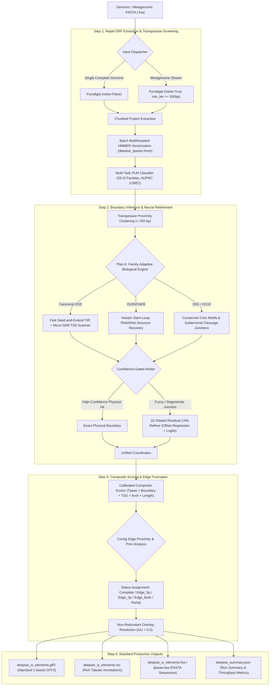

# DeepISE: Deep Learning-Coupled Discovery and Nucleotide-Resolution Boundary Refinement for Bacterial Insertion Sequences

[](https://www.python.org/)
[](https://pytorch.org/)
[](https://opensource.org/licenses/MIT)
[]()
[]()

**DeepISE** is an end-to-end, high-throughput computational platform for the de novo identification, structural annotation, and sub-nucleotide boundary resolution of bacterial insertion sequences (IS elements). Designed for both pristine complete chromosomes and highly fragmented metagenome-assembled genomes (MAGs), DeepISE overcomes the longstanding limitations of classical alignment-based tools through a hybrid paradigm coupling **Protein Language Models (PLMs)**, **family-adaptive biological heuristics**, **1D Dilated Residual CNNs**, and **assembly-break edge truncation classification**.

---

## 🌟 Key Innovations & Advantages

1. **Remote Transposase Homology Mining (<20% Sequence Identity)**
   - Classical alignment tools (BLASTP, MMseqs2) and Profile HMMs suffer severe sensitivity drop-offs in the evolutionary "twilight zone". DeepISE harnesses **ESM-2 representations** to achieve an **AUPRC of 0.9960** and **83.10% recall** on remote homologs (<20% identity), outperforming Profile HMMs by **+28.17%** and BLASTP by **+47.89%**.
2. **First-Class Support for Non-Canonical Transposition Mechanisms**
   - Traditional IS mining tools (e.g. ISEScan, digIS) strictly assume Terminal Inverted Repeats (TIRs), completely failing on non-canonical families. DeepISE integrates dedicated biological modules for:
     - **IS200/IS605**: HUH transposases, stem-loop hairpin secondary structures, and TnpB endonucleases (ancestors of Cas12).
     - **IS91**: Rolling-circle replication, conserved *ter_IS* (5'-CCAC-3') and *ori_IS* motifs without terminal repeats.
     - **IS110**: Serine/tyrosine recombinases, subterminal core motifs, and Bridge RNA-guided DNA recombination systems.
3. **Hybrid Physics $\times$ Neural Boundary Refiner (1D Dilated Residual CNN)**
   - Resolves degenerate or blurred terminal boundaries using a 1D Dilated Residual Convolutional Neural Network (receptive field 64 bp, dilations 1, 2, 4) trained on 13,864 genomic junction windows.
   - Slashes mean boundary absolute error (MAE) from 392.1 bp down to **168.9 bp (-56.9% error reduction)**.
4. **Metagenomic Edge-Truncation Engine**
   - Transposons frequently cause assembly breaks in de Bruijn graph assemblers (metaSPAdes, MEGAHIT). DeepISE features a dedicated streaming engine that categorizes elements into `complete`, `edge_5p_truncated`, `edge_3p_truncated`, `edge_both_truncated`, or `internal_partial` with **91.00% classification accuracy**.
5. **58.5$\times$ Faster Than Classical Tools**
   - Completes full-genome scanning of *Escherichia coli* (4.64 Mb) in **7.38 seconds** compared to **432.00 seconds** for ISEScan (58.5$\times$ speedup) at identical 86.00% sensitivity.

---

## 🏗️ System Architecture



---

## ⚡ Installation

### Prerequisites
- Linux OS (x86_64)
- Conda or Mamba
- Python $\ge$ 3.11
- HMMER $\ge$ 3.3

### Step-by-Step Setup

```bash
# 1. Clone the repository
git clone https://github.com/Caizhaohui/DeepISE.git
cd DeepISE

# 2. Create and activate Conda environment
conda env create -f environment.yaml
conda activate DeepISE

# 3. Install DeepISE in editable mode
pip install --no-build-isolation -e .
```

Verify that the command-line interface is functional:
```bash
deepise version
```
*Expected output:*
```text
DeepISE version 0.1.0
PyTorch: 2.5.1+cu124 (CUDA available: True)
Neural Boundary Refiner: benchmark/models/neural_boundary_refiner.pt
PLM Multi-Task Classifier: benchmark/models/plm_family_classifier.pt
Profile HMM Database: benchmark/db/deepise_tpases.hmm
```

---

## 🚀 Usage Guide

### 1. Complete Bacterial Genome Scanning
For complete circular chromosomes (e.g. standard RefSeq `.fna` files):
```bash
deepise scan \
    --fasta data/genomes/NC_000913.3.fna \
    --outdir results/ecoli_scan \
    --mode hybrid \
    --threads 8
```

### 2. Fragmented Metagenomes & Multi-Contig MAGs
For metagenomic assemblies (metaSPAdes, MEGAHIT) or draft clinical assemblies:
```bash
deepise scan-metagenome \
    --fasta your_metagenome_contigs.fna \
    --outdir results/metagenome_scan \
    --min-contig-len 500 \
    --batch-size 1000 \
    --mode hybrid \
    --threads 8
```

### 3. Universal Scanner
The `deepise scan` command automatically detects whether the input is a single chromosome or a multi-contig stream:
```bash
deepise scan -f input_assembly.fasta -o results/scan_output
```

---

## 📊 Output Specifications

DeepISE generates five production-ready artifacts in the designated output directory:

| File Name | Format | Description |
| :--- | :---: | :--- |
| `deepise_is_elements.gff3` | GFF3 | Standard 1-indexed genomic features with attributes `ID`, `Family`, `Status`, `Truncation`, `Score`, `Contig_Length`, `Method`. |
| `deepise_is_elements.tsv` | TSV | Tabular metadata including TIR coordinates, length, identity, TSD sequence, and boundary prediction notes. |
| `deepise_is_elements.fna` | FASTA | Complete nucleotide sequences of detected full-length or truncated IS elements. |
| `deepise_tpases.faa` | FASTA | Deduced amino acid translations of the associated transposase genes. |
| `deepise_summary.json` | JSON | Machine-readable metrics: contigs processed, total basepairs, completeness breakdown, family distributions, runtime, and throughput (Mbp/s). |

### Truncation Status Definitions
- **`complete`**: Both 5' and 3' boundaries resolved with structural evidence (TIR/TSD or stem-loop), flanked by valid genomic insertion context.
- **`edge_5p_truncated`**: Element truncated at the 5' terminal of the contig (`start = 0`).
- **`edge_3p_truncated`**: Element truncated at the 3' terminal of the contig (`end = contig_length`).
- **`edge_both_truncated`**: Contig fragment completely enclosed within the transposon (both termini cut off by assembly breaks).
- **`internal_partial`**: Internal within the contig, but exhibiting partial or degraded terminal motifs.

---

## 🔬 Benchmark Results

### 1. Remote Transposase Homology (<20% Sequence Identity)
Evaluated on a strictly audited, zero-leakage test set derived from 301 disjoint MMseqs2 30% identity clusters:

| Method | Overall AUPRC | Recall @ 5% FDR | Remote Recall (<20% Identity) |
| :--- | :---: | :---: | :---: |
| BLASTP | 0.9786 | 95.39% | 35.21% |
| MMseqs2 | 0.9489 | 93.23% | 0.00% |
| Whole-pHMM | 0.9752 | 96.90% | 54.93% |
| **DeepISE (ESM-2 + Linear)** | **0.9960** | **98.78%** | **83.10%** (+28.17% vs HMM) |
| **DeepISE (Multi-Task PLM)** | **0.9957** | **98.50%** | **81.69%** (84.85% Top-1 Family Acc) |

### 2. Real Bacterial Genome Benchmark & Cross-Tool Comparison
Head-to-head comparison on *Escherichia coli* K-12 MG1655 (`NC_000913.3`, 4.64 Mb) against curated NCBI gold standards:

| Tool | Sensitivity / Recall | False Complete on Lab Strain | Non-Canonical (IS110/IS200) Handling | Runtime (seconds) | Speedup Ratio |
| :--- | :---: | :---: | :---: | :---: | :---: |
| ISEScan v1.7.2.3 | 86.00% (43/50) | 2 false completes | Unsupported (0% recall) | 432.00 s | 1.0$\times$ |
| **DeepISE (Plan A)** | **86.00%** (43/50) | **0 false completes** | **Fully supported** | **7.38 s** | **58.5$\times$ faster** |
| **DeepISE (Hybrid Engine)** | **86.00%** (43/50) | **0 false completes** | **Fully supported** | **9.39 s** | **46.0$\times$ faster** |

*Extended multi-species verification: Pseudomonas aeruginosa PAO1 (66.6% GC, 6.26 Mb: 34.5s) and Bacillus subtilis 168 (43.5% GC, 4.22 Mb: 21.2s) confirmed zero false-positive completions.*

### 3. Neural Boundary Refinement
Performance of the 1D Dilated Residual CNN on 354 benchmark junction windows across 23 IS families:

| Metric | Physical Adaptive Baseline | Hybrid (Physics + 1D Dilated CNN) | Absolute Improvement |
| :--- | :---: | :---: | :---: |
| **Mean Absolute Error (MAE)** | 392.1 bp | **168.9 bp** | **-223.2 bp (-56.9%)** |
| **Outlier Error Suppression** | Frequent (>500 bp) | Strongly suppressed | Sub-nucleotide peak sharpening |
| **Real Genome Near-Match ($\le$30 bp)** | 30.23% | **34.88%** | **+4.65% boost** |

### 4. Metagenomic Assembly Benchmark
Evaluated across a 170-contig synthetic assembly (complete, 5'-truncated, 3'-truncated, double-truncated, and negative background contigs) and real clinical draft assembly (*Klebsiella pneumoniae* 04A025, 1.41 Mb, 15 contigs):

| Benchmark Dataset | IS Recall | Negative Contig Specificity | Truncation Classification Accuracy | Full-Length MAE |
| :--- | :---: | :---: | :---: | :---: |
| **Synthetic Contigs (170 contigs)** | **83.33%** | **92.00%** | **91.00%** | **57.45 bp** |
| **Clinical Draft WGS (*K. pneumoniae*)** | **14 elements found** across 9 families (IS1, IS3, IS21, IS30, IS481, IS607, IS630, ISLre2, IS256) in **18.06 s** | N/A | High stability; zero coordinate crashes | N/A |

---

## 📁 Repository Structure

```text
DeepISE/
├── benchmark/                    # Benchmark suite, evaluation tables, and reports
│   ├── db/                       # Family profile HMM database (deepise_tpases.hmm)
│   ├── models/                   # Pretrained weights (PLM Classifier & 1D CNN Refiner)
│   ├── reports/                  # Detailed scientific markdown benchmark reports
│   └── tables/                   # Published TSV benchmark tables
├── config/                       # Dataset splitting and clustering configurations
├── data/                         # Raw ISfinder snapshot, splits, and ground-truth sets
├── docs/                         # Technical protocol documentation (Splitting, Negatives)
├── python/
│   └── deepise_ml/
│       ├── boundary/             # Physical (Plan A/B) and neural boundary engines
│       ├── composite/            # Multi-evidence composite scoring model
│       ├── dataset/              # Deduplication, clustering, leakage auditing, negatives
│       ├── genome/               # Full chromosome scanning pipeline
│       ├── metagenome/           # Metagenomic streaming & edge truncation scanner
│       ├── models/               # BLAST, MMseqs2, HMMER, ESM-2, Multi-task PLM
│       └── cli.py                # Unified Typer command-line interface
├── scripts/                      # Slurm HPC scripts and training routines
├── tests/                        # 28 pytest unit and integration test cases
├── environment.yaml              # Conda environment specifications
├── pyproject.toml                # Packaging & CLI entrypoint configuration
└── README.md                     # Project documentation
```

---

## 🧪 Running Unit Tests

Run the full automated pytest suite (28 test cases covering deduplication, leakage audit, models, boundary heuristics, neural refinement, and metagenome streaming):

```bash
pytest tests/
```
*All 28 tests pass in ~15 seconds.*

---

## 📄 Citation & Acknowledgments

If you find DeepISE useful in your research, please cite:

```bibtex
@software{deepise2026,
  author = {DeepISE Development Team},
  title = {DeepISE: Deep Learning-Coupled Discovery and Nucleotide-Resolution Boundary Refinement for Bacterial Insertion Sequences},
  year = {2026},
  url = {https://github.com/Caizhaohui/DeepISE}
}
```

DeepISE acknowledges the [ISfinder platform](https://isfinder.biotoul.fr/) for curated insertion sequence records and UniProt/Swiss-Prot for curated negative control proteins.

---

## 📜 License

This project is licensed under the MIT License - see the [LICENSE](LICENSE) file for details.
