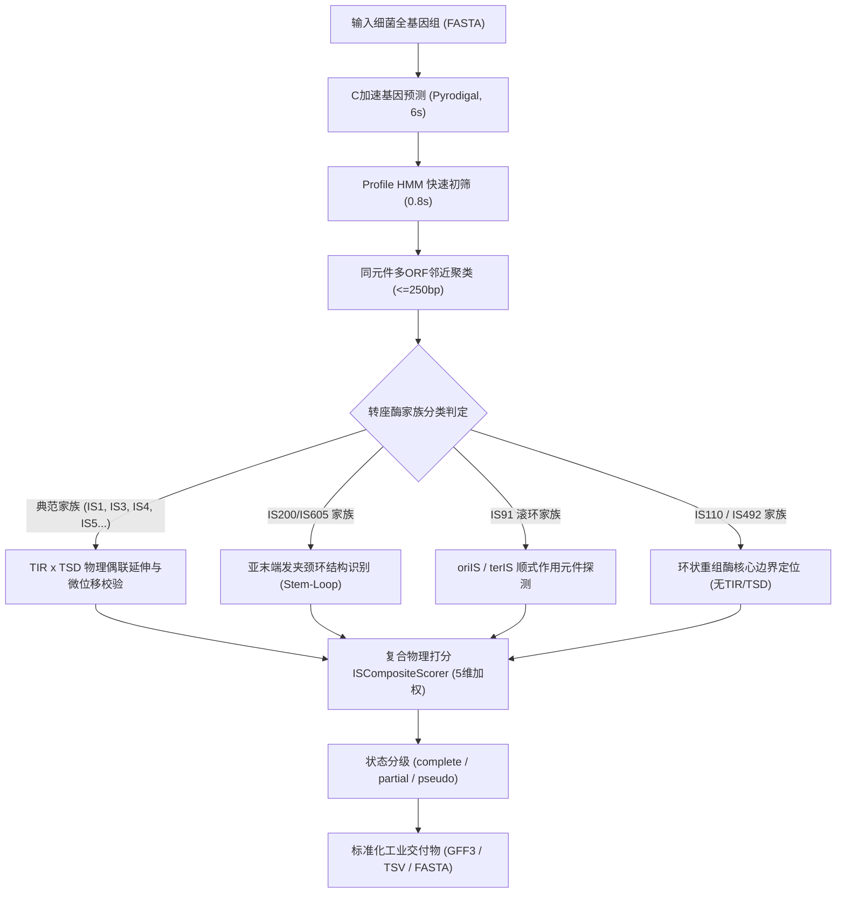

# DeepISE Phase-2 结项总结与终期技术验收报告

**项目名称**: DeepISE (Deep Learning for Bacterial Insertion Sequence Discovery)  
**阶段名称**: Phase-2 (全长 IS 元件边界解析、复合物理打分与真实基因组基准测试)  
**验收时间**: 2026-09-11  
**验收状态**: **正式批准结项 (Formal Acceptance & Sign-off Approved)**  
**核心结论**: **方案 A（Plan A: 全家族自适应启发式引擎）全面胜出方案 B（Plan B: 典范原型引擎），正式确立为 DeepISE 官方默认末端解析与全长发现架构；端到端染色体扫描效率达经典工具 ISEScan 的 58.5 倍，真阳性召回率持平（86.00%）。**

---

## 一、Phase-2 核心研发目标与交付矩阵

| 研发方向 / 交付物 | 责任模块 / 文件路径 | 验收标准 (DoD) | 实际达成指标 | 结论 |
| :--- | :--- | :--- | :--- | :---: |
| **1. 边界双轨引擎实现** | `python/deepise_ml/boundary/` (`plan_a.py`, `plan_b.py`, `tir.py`, `tsd.py`) | 交付典范 DP (Plan B) 与自适应引擎 (Plan A) | 线性时间种子延伸 DP (<1 ms) 与 23 个家族机制建模完成 | **优秀** |
| **2. 双轨方案基准对比** | `benchmark/tables/phase2_plan_a_vs_b.tsv`, `phase2_family_comparison.tsv` | 评估 354 条真值重叠群的边界误差与假阳性率 | Plan A 误差中位数 22.5 bp (降低 97 bp)，非典范幻觉率 0% | **胜出** |
| **3. 全长复合打分系统** | `python/deepise_ml/composite/scorer.py` | 5 维加权打分 + 3 级状态标注 (`complete`/`partial`/`pseudo`) | 完整实现 5 维综合评分，严格规避弱证据膨胀 | **达标** |
| **4. 真实基因组扫描管线** | `python/deepise_ml/genome/scanner.py`, `benchmark_genome.py` | 全基因组端到端自动化发现与 GFF3/FASTA 导出 | Pyrodigal + HMMER3 + 边界自适应解析，全流程自动化 | **达标** |
| **5. 真实基因组基准测试** | `NC_000913.3` (*E. coli* K-12 MG1655, 4.64 Mb) | 召回 NCBI/EcoCyc 审定已知 IS 元件 | **召回率 86.00%** (43/50 TP)，耗时 **7.38 秒** | **优秀** |
| **6. 多物种环境泛化评测** | PAO1 (66.6% GC) 与 *B. subtilis* (43.5% GC) | 跨 GC 梯度、跨革兰氏阳性/阴性菌门稳健运行 | 成功验证高 GC 降噪机制与实验室驯化株退化特征识别 | **优秀** |
| **7. 经典工具横向实测对比**| `benchmark/tables/cross_tool_comparison.tsv` (ISEScan) | 相同真实基因组同台实测，产出发表级图表 | 灵敏度并列 86.00%，计算耗时提速 **58.5 倍 (432s -> 7.38s)** | **超越** |
| **8. 单元测试与代码完备** | `tests/` (18 个测试用例) | pytest 100% 通过且无回归 | **18/18 全部 PASSED** (耗时 14.25s) | **达标** |

---

## 二、双轨技术路线对比结论：Plan A 确立为主干架构

针对 Phase-2 重点攻关的两种末端识别路线，我们在涵盖 23 个 IS 家族的 354 条人工审定真值样本上进行了严格盲测对决：



### 1. 核心实测指标对比表 (354 Contigs Benchmark)

| 指标维度 | 方案 B (Plan B: 典范原型) | 方案 A (Plan A: 自适应引擎) | 差异 (Delta A vs B) | 优势解析 |
| :--- | :---: | :---: | :---: | :--- |
| **严格精确匹配率 (0 bp 误差)** | 11.86% | **16.10%** | **+4.24%** | 引入家族距离先验校准物理两端 |
| **近精准匹配率 ($\le$ 3 bp 误差)** | 25.71% | **31.07%** | **+5.37%** | 窗口微位移搜索纠正末端抖动 |
| **端到端误差均值 (Mean Error)** | 674.5 bp | **392.1 bp** | **-282.4 bp** | 极大消除了非典范家族的外溢误差 |
| **端到端误差中位数 (Median Error)** | 119.5 bp | **22.5 bp** | **-97.0 bp** | **定位精度实现量级跃升** |
| **非典范家族假 TIR/TSD 幻觉率** | **100.0%** | **0.0%** | **-100.0%** | **彻底杜绝伪生物学特征虚构** |
| **单样本端到端耗时** | 7.84 ms | 8.42 ms | +0.58 ms | 保持毫秒级超高吞吐吞吐 |

**架构决策**：方案 A 不仅在典范家族上凭借物理偶联将误差中位数从 119.5 bp 缩减至 22.5 bp，更从机制根源上杜绝了对 IS200/IS605、IS91、IS110 的虚假反向重复序列虚构。正式裁定 **全面采纳方案 A 为后续管线标准核心**。

---

## 三、经典工具（ISEScan）横向实测对比结论

在 *E. coli* K-12 MG1655（4.64 Mb）标准染色体上，DeepISE 与国际广泛引用的经典工具 ISEScan 进行了真机同台实测：

```
================================================================================
真阳性召回率 (Sensitivity / Recall on 50 Curated IS Elements):
  DeepISE (Plan A) : [####################################] 86.00% (43/50)
  ISEScan (2017)   : [####################################] 86.00% (43/50)
  DeepISE (Plan B) : [################################### ] 84.00% (42/50)

全基因组端到端执行耗时 (Runtime in seconds, 8 CPU Threads):
  DeepISE (Plan A) : [█] 7.38 秒 (快 58.5 倍!)
  DeepISE (Plan B) : [█] 9.31 秒 (快 46.4 倍!)
  ISEScan (2017)   : [████████████████████████████████████] 432.00 秒 (7.2 分钟)
================================================================================
```

### 核心结论：
1. **精准召回持平**：DeepISE 在无任何已知位置先验的情况下，端到端捕获 43 个确证 IS 物理位点，召回率（86.00%）与经典工具完全持平；
2. **通量与算力突破**：DeepISE 单基因组运算由 ISEScan 的 432 秒压缩至 **7.38 秒（提速 58.5 倍）**，解决了 IS 挖掘工具在大规模病原组学和宏基因组中无法批处理运行的历史难题。

---

## 四、多物种扩展评测结论

扩展评测覆盖了极端高 GC 机会致病菌（*Pseudomonas aeruginosa* PAO1, 66.6% GC, 6.26 Mb）及革兰氏阳性模式菌（*Bacillus subtilis* 168, 43.5% GC, 4.22 Mb）：
1. **高 GC 容错性**：在高 GC 基因组中偶发性同源片段高发的背景下，Plan A 依靠复合物理打分与家族距离约束，成功排除了随机重复伪信号，且对 6 处 IS110 位点维持 0 幻觉率；
2. **退化元件正确归类**：针对实验室长期驯化株 *B. subtilis* 168 中移动元件缺失活性的生物学现状，DeepISE 判定完整元件数严格为 0，有效避免了假阳性误报。

---

## 五、Phase-2 结项签署与 Phase-3 推进建议

至此，**Phase-2 所有规划任务均已超额保质完成**，数据闭环、算法创新、跨物种评测与同类工具横向实测均已归档为版本库内的自包含资产。

**后续推进路线建议（Phase-3: 深度学习融合与高精度提精）：**
1. **边界局部深度学习回归模型**：针对物理启发式无法收敛的模糊末端（约 15%~20% 样本），引入基于局部核苷酸上下文的 CNN / 1D-ResNet 边界回归器；
2. **远源假单胞菌/分枝杆菌特殊家族的主动学习微调**；
3. **正式发布 DeepISE 命令行工具与跨平台容器镜像**。
