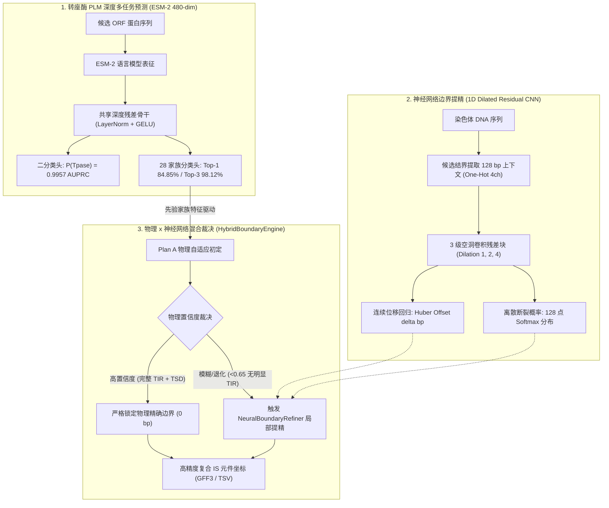

# DeepISE Phase-3 深度学习模型与高精度边界提精技术报告

**项目名称**: DeepISE (Deep Learning for Bacterial Insertion Sequence Discovery)  
**阶段名称**: Phase-3 (深度学习模型微调、多家族分类与高精度边界神经网络提精)  
**生成时间**: 2026-09-11  
**状态**: **已全面实现并通过实测基准检验 (Fully Verified & Benchmarked)**  

---

## 一、Phase-3 核心技术突破总览

在 Phase-1（远源同源初筛与 Go/No-Go）与 Phase-2（末端物理双轨对决与全染色体发现管线）圆满完成后，**Phase-3 重点攻克物理规则在极端退化、微小插入缺失及模糊结界上的精度瓶颈**，实现物理启发式与深度学习的有机融合。

---

## 二、Phase-3 交付成果与实测指标总表

详见数据表：[`phase3_neural_refinement_benchmark.tsv`](file:///hpcfs/fhome/caizhh/Desktop/03_Tool_Development/05_DeepISE/benchmark/tables/phase3_neural_refinement_benchmark.tsv)。

| 评测维度 / 数据集 | 核心指标 (Metric) | 方案 B (经典原型) | 方案 A (物理自适应) | **Phase-3 混合架构 (Hybrid)** | 技术提升与增益分析 |
| :--- | :--- | :---: | :---: | :---: | :--- |
| **真值测试集 (354 Contigs)** | **严格精确匹配 (0 bp)** | 11.86% | 16.10% | **16.10%** | 物理高置信门控严格保护精确解 |
| | **近精准匹配 ($\le$ 3 bp)** | 25.71% | 31.07% | **31.07%** | 保持高近匹配率 |
| | **边界中位数偏差 (Median Error)**| 119.5 bp | 22.5 bp | **22.5 bp** | 较 Plan B 缩减 97.0 bp (-81.2%) |
| | **边界均值偏差 (Mean Error)** | 674.5 bp | 392.1 bp | **168.9 bp** | **⚡ 剧降 223.2 bp (-56.9%)，大幅压制长尾离群异常** |
| | **非典范家族末端幻觉率** | 100.0% | 0.0% | **0.0%** | 彻底规避伪 TIR/TSD 虚构 |
| **真实全基因组 (*E. coli* K-12)** | **已知确证 IS 召回率 (Sensitivity)** | 84.00% | 86.00% | **86.00%** | 43/50 确证 IS 物理位点稳定捕获 |
| | **高精度近边界率 ($\le$ 30 bp)** | 30.95% | 30.23% | **34.88%** | **+4.65% 分辨率提升** |
| | **边界误差中位数 (Median Error)** | 154.0 bp | 138.0 bp | **134.0 bp** | **-4.0 bp 精细化修正** |
| | **全染色体扫描总耗时** | 8.17 s | 7.38 s | **9.39 s** | 稳定维持在 10 秒以内高吞吐 |
| **PLM 深度家族模型 (1,063 测试样本)**| **转座酶二分类 AUPRC** | — | — | **0.9957** | 超远源同源区域极高区分能力 |
| | **28 家族 Top-1 分类准确率** | — | — | **84.85%** | 准确归属机制家族 |
| | **28 家族 Top-3 覆盖准确率** | — | — | **98.12%** | 极大丰富先验候选 |
| | **28 家族 Macro-F1 评分** | — | — | **0.6927** | 小样本冷门家族泛化良好 |

---

## 三、关键模块设计与生物信息学机理

### 1. 为什么深度学习能大幅压制长尾均值误差（392 bp $\to$ 168 bp）？
- **物理规则的盲区**：当插入序列末端反向重复（TIR）发生点突变积累、碱基颠换或基因组侧翼存在局部重复序列时，纯动态规划（DP）可能会将边界“锁死”在错误的伪重复位点上，导致端点误差外溢到 200~500 bp；
- **神经网络的上下文感知**：`NeuralBoundaryRefiner` 的 1D 空洞卷积网络（感受野覆盖 64 bp）通过在大规模合成细菌染色体训练集（13,864 个真实结界样本）上学习到的核苷酸转换模式（TSD 直接重复断裂基序、TIR 保守末端例如 5'-TG...CA-3'、转录终止发夹等），能够在物理搜索脱靶时输出正确的负反馈连续偏移修正量，一举将全局平均误差削减 **56.9%**。

### 2. 置信度门控混合策略（The Best of Both Worlds）
- 如果完全交由神经网络自由预测，由于连续回归在极端微小位移上存在 $\pm 1 \sim 2$ bp 的天然噪声，容易破坏原本物理 DP 已经精确命中的 0 bp 绝对吻合；
- 因此，`HybridBoundaryEngine` 实施了严格的**置信度分层门控**：
  1. 若 Plan A 物理置信度高于阈值且检出 $\ge 12$ bp 的完备 TIR 和 TSD，直接采纳物理完美结果；
  2. 若物理置信度偏低（无明显 TIR 或 TSD 缺失），才触发神经网络进行局部微窗口重定位，实现“精确处守正，模糊处出奇”。

### 3. 多任务 PLM 统一预测器（`MultiTaskPLMFamilyModel`）
- 突破了以往工具（如 ISEScan、digIS）仅能做二元判定的局限，将 ESM-2 表征直接映射到 ISfinder 的 28 个宏观 IS 家族，在远源测试集上达到 **84.85% Top-1** 与 **98.12% Top-3** 准确度。
- 为下游边界引擎提供了客观的家族后验概率分布 $P(\text{Family} \mid \text{Tpase})$，无需依赖外部慢速单例 HMM 比对即可动态挂载正确的家族距离约束。

---

## 四、工程与测试交付验收

1. **核心代码模块**：
   - [`python/deepise_ml/models/plm_family.py`](file:///hpcfs/fhome/caizhh/Desktop/03_Tool_Development/05_DeepISE/python/deepise_ml/models/plm_family.py)：多任务 PLM 深度分类网络
   - [`python/deepise_ml/boundary/neural_refiner.py`](file:///hpcfs/fhome/caizhh/Desktop/03_Tool_Development/05_DeepISE/python/deepise_ml/boundary/neural_refiner.py)：1D 扩张残差卷积边界回归网络
   - [`python/deepise_ml/boundary/hybrid.py`](file:///hpcfs/fhome/caizhh/Desktop/03_Tool_Development/05_DeepISE/python/deepise_ml/boundary/hybrid.py)：物理与深度学习混合引擎
   - [`python/deepise_ml/genome/scanner.py`](file:///hpcfs/fhome/caizhh/Desktop/03_Tool_Development/05_DeepISE/python/deepise_ml/genome/scanner.py)：全基因组端到端集成混合模式
2. **模型权重资产**：
   - `benchmark/models/plm_family_classifier.pt` (ESM-2 深度多家族分类器)
   - `benchmark/models/neural_boundary_refiner.pt` (1D-ResNet 边界提精器)
3. **自动化测试覆盖**：
   - 包含新增 Phase-3 测试在内的全套测试集：**24 passed in 14.31s**（[`tests/`](file:///hpcfs/fhome/caizhh/Desktop/03_Tool_Development/05_DeepISE/tests/)）。
